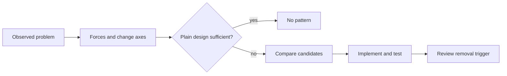
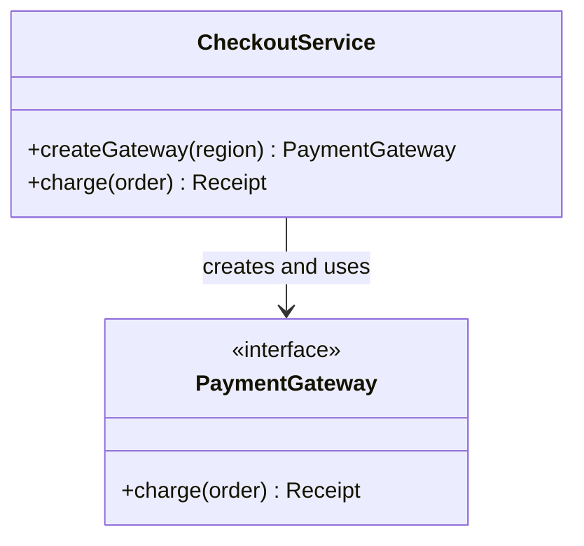
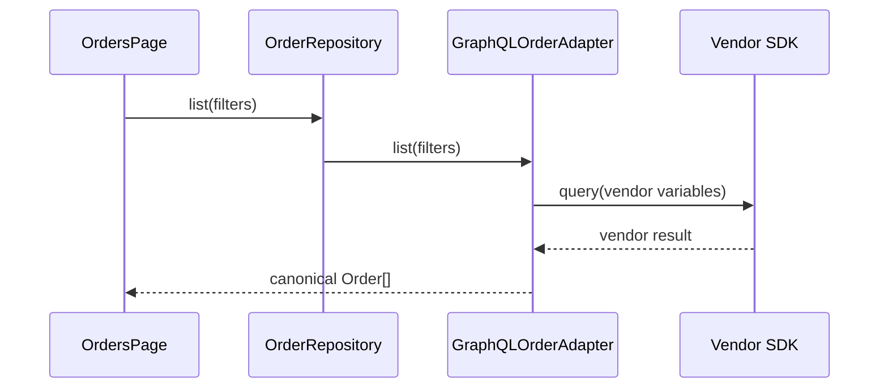
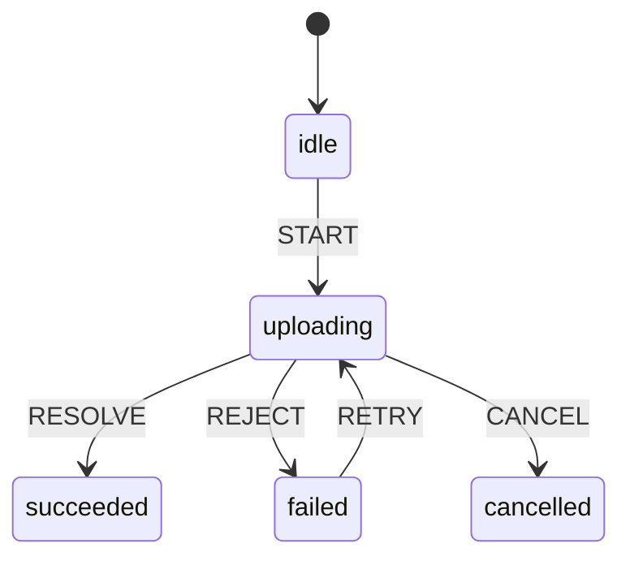
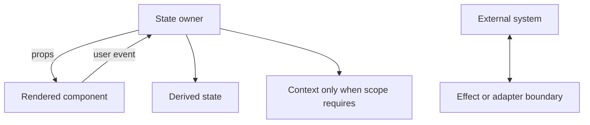
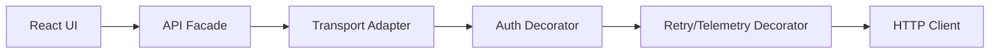
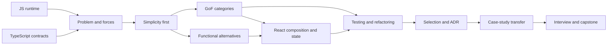

# GoF and React Design Patterns Domain Core

Generated compact domain core for `gof-react-patterns`.

This file consolidates canonical domain sources. It is generated from reusable domain content and does not contain learner-specific progress.

## DOMAIN.md

Canonical source: `domains/gof-react-patterns/DOMAIN.md`.

# GoF and React Design Patterns Domain

## Domain Identity

- Domain id: `gof-react-patterns`
- Domain title: `GoF and React Design Patterns`
- Domain version: `0.1.0-draft`
- Primary implementation: TypeScript
- Secondary comparison: JavaScript runtime behavior
- UI application: React/TSX
- Testing: Vitest; rendered behavior üçün React Testing Library

## Məqsəd və auditoriya

Bu domain JavaScript/TypeScript və React fundamentals bilən Front-End, Full-Stack və UI Platform engineers üçün pattern-selection, refactoring və architecture judgment qurur. Learner real problem-dən forces çıxarır, naive design-in failure mode-unu göstərir, minimum design-i derivasiya edir, TypeScript implementation və test yazır, functional alternative ilə müqayisə edir və pattern-in nə vaxt silinməli olduğunu müdafiə edir.

Prerequisites:

- closure, object, prototype, module, composition və async JavaScript;
- TypeScript union, interface, generic və type narrowing;
- React component, props, state, context, hooks və render lifecycle fundamentals;
- basic automated testing və dependency boundary anlayışı.

Zəif prerequisite aşkar edilərsə mentor Module 1–2 remediation verir. Professional title və lesson exposure readiness/mastery evidence deyil.

## Learner Outcomes

Learner observable evidence ilə:

- bütün 23 GoF pattern-i problem, intent, structure, alternatives və misuse baxımından izah edir;
- creational, structural və behavioral pattern-lər arasında seçim edir;
- class-heavy implementation-u composition, closure, function, discriminated union və data-driven alternative ilə müqayisə edir;
- 20 React pattern-i component API, state ownership, composition və rendered behavior kontekstində tətbiq edir;
- GoF–React əlaqələrini conceptual analogy kimi istifadə edir, false one-to-one equivalence iddia etmir;
- Vitest və lazım olduqda React Testing Library ilə public behavior test edir;
- pattern smell, abstraction debt, speculative generality və framework imitation-u tapır;
- existing design-i safety-net tests ilə refactor edir və artıq pattern-i silir;
- architecture və interview qərarlarını trade-off, change axis və evidence ilə müdafiə edir.

## Scope və Non-Goals

- GoF catalog vocabulary-dir, universal recipe və ya mandatory architecture deyil.
- React patterns GoF catalog-un “React versiyası” deyil; bəzi forces oxşar olsa da lifecycle, rendering və state ownership fərqlidir.
- TypeScript primary complete implementation dilidir. JavaScript müqayisəsi yalnız erased types, prototype, closure və runtime validation fərqini aydınlaşdıranda verilir.
- Functional alternative daha sadədirsə ona üstünlük verilə bilər.
- Toy `Dog`, `Cat`, `Car` hierarchies istifadə olunmur; notification, checkout, permissions, API, table, dialog, editor, upload və pricing scenarios istifadə olunur.
- Code və tests canonical educational Markdown examples-dır. Domain React/Vitest dependency-si və runnable app infrastructure əlavə etmir.
- Pattern tətbiq etmək məqsəd deyil. “No pattern”, plain function, local state və direct composition həmişə candidate-dir.
- Learner state burada saxlanmır və learner activity evidence-i olmadan progress dəyişmir.

## Localization

Teaching, feedback və lesson flow Azerbaijani dilindədir. `Factory Method`, `Strategy`, `composition`, `state ownership`, `render props`, `custom hook`, `trade-off`, `test double` kimi established technical terminology English saxlanılır. Code, API, filename, type və test names English qalır.

## Mentor və Runtime Behavior

- Default `START_LESSON` foundations-dan başlayır və teach → guided check → feedback → guided practice → independent practice ardıcıllığını saxlayır.
- Mentor əvvəl problem və naive design göstərir, sonra forces-dan design derivasiya edir; pattern adını solution oracle kimi erkən vermir.
- Hər major implementation public behavior test-i, alternatives, testing implications, misuse, overengineering və “when no pattern is preferable” bölməsi ilə gəlir.
- React Testing Library yalnız rendered user-observable behavior olduqda istifadə olunur; pure logic Vitest ilə test edilir.
- Full solution attempt-dən əvvəl göstərilmir. Normal cavab bir aydın learner action istəyir.
- Mermaid diagram educational simplification-dırsa label bunu açıq deyir; diagram code-un əvəzi deyil.
- Mastery yalnız implementation, tests, explanation, trade-off və transfer evidence ilə qiymətləndirilə bilər.

## Command Matrix

| Command | Domain behavior | Evidence/state boundary |
| --- | --- | --- |
| `START_TRACK` | Goal və prerequisite-lərə görə foundations, GoF, React, refactoring və ya interview path seçir. | Track göstərmək mastery yaratmır. |
| `START_LESSON` | Next pattern/concept-i 28-part contract ilə teaching-first başlayır. | İlk action guided check-dir. |
| `CONTINUE_LESSON` | Learner response-u review edir, misconception-u repair edir və bir next action verir. | Yalnız observed response evidence ola bilər. |
| `PRACTICE` | Selection, implementation, testing, refactoring, review və removal task seçir. | Solution attempt-dən əvvəl açılmır. |
| `REVIEW` | Weak, stale, failed və ya requested skill üçün retrieval practice qurur. | Review scheduling state contract-a tabedir. |
| `ASSESS` | Unseen/transfer scenario-da implementation, tests və defense yoxlayır. | Evidence olmadan mastery claim etmir. |
| `START_PROJECT` | `PROJECTS.md` case/capstone milestone-larını incremental başlayır. | Mentor deliverable-i learner əvəzinə tamamlamır. |
| `INTERVIEW` | Junior, Mid, Senior və Staff/Lead mode-da timed və ya coached interview aparır. | Feedback attempt-dən sonra verilir. |
| `SHOW_PROGRESS` | Supplied learner state və evidence-i concise göstərir. | Missing state/evidence dürüst bildirilir; silent mutation yoxdur. |

## SYLLABUS.md

Canonical source: `domains/gof-react-patterns/SYLLABUS.md`.

# GoF and React Design Patterns Syllabus

`gof-react-patterns.main` 15-module progressive curriculum-dur. Catalog coverage lesson count deyil: hər pattern problem → naive design → forces → derivation → implementation → tests → trade-offs → practice flow-u ilə öyrədilir və later transfer ilə yoxlanılır.

## Every Individual Pattern Lesson: 28-Part Contract

GoF və React pattern lesson-lərinin hər biri bu 28 hissəni konkret pattern/scenario üçün doldurur:

1. Lesson title və stable skill ID.
2. Prerequisites və evidence check.
3. Realistic application context.
4. User/business problem.
5. Naive design.
6. Naive design failure mode.
7. Forces və change axes.
8. Simplest/no-pattern candidate.
9. Pattern intent, yalnız problem anlaşılandan sonra.
10. Roles və responsibilities.
11. Purposeful Mermaid diagram; simplification label-i.
12. Step-by-step derivation.
13. Public TypeScript contract.
14. Complete primary TypeScript implementation.
15. JavaScript runtime comparison, yalnız clarity verirsə.
16. Functional/data-driven alternative.
17. React/TSX connection, applicable-dirsə.
18. Vitest tests.
19. React Testing Library test, yalnız render varsa.
20. Failure paths və edge cases.
21. Testing implications və useful test doubles.
22. Benefits.
23. Costs və trade-offs.
24. Alternatives və selection criteria.
25. Misuse/anti-pattern.
26. Overengineering və “when no pattern is preferable”.
27. Guided practice + progressive hints.
28. Independent transfer, retrieval prompt və evidence checkpoint.

Mentor bu structure-u bir cavaba sıxışdırmır; teaching-first phases turn-lar arasında davam edə bilər. Complete solution attempt-dən əvvəl göstərilmir.

## Module 1 — Design Foundations: Problem Before Pattern

- Concepts: cohesion, coupling, encapsulation, composition over inheritance, dependency direction, stable/unstable boundary, change axis, accidental complexity, YAGNI.
- TypeScript: structural typing, interface as contract, discriminated union; types runtime validation deyil.
- JavaScript comparison: classes prototype üzərində runtime constructs-dır; `private` type-only və `#private` runtime semantics fərqlidir.
- Practice: notification routing və checkout conditions üçün problem/forces çıxar, plain function candidate-i qur.
- Checkpoint: learner pattern name istifadə etmədən minimum design müdafiə edir.



Diagram educational selection simplification-dır; feedback nəticəsində əvvəlki mərhələyə qayıtmaq normaldır.

## Module 2 — TypeScript, JavaScript, Testing və Diagram Literacy

- Contracts: generics, unions, exhaustive `never`, function types, object composition.
- Runtime: closure state, prototype delegation, module singleton, import caching.
- Tests: Vitest AAA, observable behavior, fake/spy/stub boundaries, deterministic time və IDs.
- Diagrams: Mermaid class, sequence, state, flow və component diagrams; role diagram-ı exact runtime object graph kimi təqdim etmə.
- Baseline task: pricing rule-u union, lookup və Strategy ilə həll et; simplest solution-u seç.

```ts
export type PriceContext = { subtotal: number; segment: "retail" | "partner" };
export type PricingRule = (context: PriceContext) => number;

export const partnerDiscount: PricingRule = ({ subtotal, segment }) =>
  segment === "partner" && subtotal >= 500 ? subtotal * 0.15 : 0;
```

```ts
import { describe, expect, it } from "vitest";

describe("partnerDiscount", () => {
  it.each([
    [{ subtotal: 499, segment: "partner" }, 0],
    [{ subtotal: 500, segment: "partner" }, 75],
    [{ subtotal: 500, segment: "retail" }, 0],
  ] as const)("returns the public discount for %o", (context, expected) => {
    expect(partnerDiscount(context)).toBe(expected);
  });
});
```

## Module 3 — Creational GoF Patterns (5)

Hər lesson 28-part contract-a tabedir.

| Lesson | Pattern | Realistic derivation və required comparison |
| --- | --- | --- |
| 3.1 | Factory Method | Payment provider connector creation; direct constructor/simple factory; functional factory; lifecycle tests; subclass explosion və no-pattern threshold |
| 3.2 | Abstract Factory | Theme/design-system family: button, dialog, tokens; independent factories; React provider connection; inconsistent family test; two variants üçün overengineering |
| 3.3 | Builder | Valid multi-step API request/report configuration; object literal + validation; fluent vs functional builder; invalid intermediate state və test-data builder misuse |
| 3.4 | Prototype | Dashboard widget configuration cloning; immutable spread/structured clone; identity/deep-copy risks; React element cloning ilə false equivalence-dən qaç |
| 3.5 | Singleton | Process-wide telemetry registry candidate; module instance/dependency injection; test isolation, SSR/request leakage; default olaraq reject etməyi bacar |

Factory Method educational class simplification:



Required implementation/test pair:

```ts
type Region = "eu" | "us";
type Receipt = { provider: string; transactionId: string };
interface PaymentGateway { charge(orderId: string): Promise<Receipt> }

export function createGateway(
  region: Region,
  deps: { eu: PaymentGateway; us: PaymentGateway },
): PaymentGateway {
  return deps[region];
}

export class CheckoutService {
  constructor(private readonly gatewayFor: (region: Region) => PaymentGateway) {}
  charge(region: Region, orderId: string) {
    return this.gatewayFor(region).charge(orderId);
  }
}
```

```ts
it("routes an EU charge through the selected gateway", async () => {
  const eu = { charge: vi.fn().mockResolvedValue({ provider: "adyen", transactionId: "tx-1" }) };
  const us = { charge: vi.fn() };
  const service = new CheckoutService((region) => createGateway(region, { eu, us }));
  await expect(service.charge("eu", "ord-1")).resolves.toMatchObject({ provider: "adyen" });
  expect(eu.charge).toHaveBeenCalledWith("ord-1");
  expect(us.charge).not.toHaveBeenCalled();
});
```

## Module 4 — Structural GoF Patterns (7)

| Lesson | Pattern | Realistic derivation və required comparison |
| --- | --- | --- |
| 4.1 | Adapter | REST/GraphQL SDK-ləri canonical order repository contract-a uyğunlaşdır; mapping errors test et; hook adapter connection-ını one-to-one equivalence sayma |
| 4.2 | Bridge | Notification abstraction-ını email/SMS transports-dan ayır; Strategy və Adapter-lə müqayisə; two-dimensional variation yoxdursa rədd et |
| 4.3 | Composite | Permission tree və dashboard layout; recursive function/data tree alternative; partial failure və identity testləri |
| 4.4 | Decorator | API client retry, auth, cache, telemetry wrappers; order-sensitive sequence test; higher-order function alternative; wrapper maze misuse |
| 4.5 | Facade | Layered API client üçün small task-oriented surface; leaky god facade və direct composition comparison |
| 4.6 | Flyweight | Large data-table cell metadata sharing; memoization/normalized data; premature memory optimization-u profiling olmadan rədd et |
| 4.7 | Proxy | Permission-aware/caching remote document access; Decorator fərqi, JavaScript `Proxy` API ilə pattern intent fərqi; hidden network cost misuse |

Adapter sequence diagram educational simplification-dır:



```ts
type Order = { id: string; totalCents: number };
type VendorOrder = { order_no: string; total: string };
interface OrderRepository { list(): Promise<Order[]> }

export class VendorOrderAdapter implements OrderRepository {
  constructor(private readonly sdk: { fetchOrders(): Promise<VendorOrder[]> }) {}
  async list(): Promise<Order[]> {
    const rows = await this.sdk.fetchOrders();
    return rows.map((row) => {
      const totalCents = Math.round(Number(row.total) * 100);
      if (!Number.isFinite(totalCents)) throw new Error(`Invalid total for ${row.order_no}`);
      return { id: row.order_no, totalCents };
    });
  }
}
```

```ts
it("maps vendor fields and rejects corrupt money", async () => {
  const valid = new VendorOrderAdapter({ fetchOrders: async () => [{ order_no: "A-7", total: "12.34" }] });
  await expect(valid.list()).resolves.toEqual([{ id: "A-7", totalCents: 1234 }]);
  const corrupt = new VendorOrderAdapter({ fetchOrders: async () => [{ order_no: "A-8", total: "n/a" }] });
  await expect(corrupt.list()).rejects.toThrow("Invalid total for A-8");
});
```

## Module 5 — Behavioral GoF Patterns (11)

| Lesson | Pattern | Realistic derivation və required comparison |
| --- | --- | --- |
| 5.1 | Chain of Responsibility | Permission/feature-flag evaluation; rules pipeline; order, short-circuit və denial reason tests |
| 5.2 | Command | Undoable editor actions və queued uploads; plain callback; serialization/undo cost; command-object explosion |
| 5.3 | Iterator | Paginated API traversal; generator/async iterator; cancellation və page failure tests |
| 5.4 | Mediator | Checkout form sections və workflow coordinator; event bus/direct callbacks; god mediator misuse |
| 5.5 | Memento | Editor snapshots; event sourcing/command inverse; memory, privacy və schema evolution |
| 5.6 | Observer | Scoped notification/store subscription; event emitter/React state; unsubscribe, reentrancy və leak tests |
| 5.7 | State | Upload lifecycle; discriminated-union reducer alternative; illegal transition tests; boolean flag explosion |
| 5.8 | Strategy | Pricing/tax algorithm variation; function map alternative; conditional simpler olduqda no-pattern |
| 5.9 | Template Method | Import pipeline invariant skeleton; function pipeline/composition; inheritance rigidity |
| 5.10 | Visitor | Versioned AST/report export operations; discriminated union exhaustive functions; new-node vs new-operation change axis |
| 5.11 | Interpreter | Filter rule language üçün small AST evaluator; parser library/direct predicates; security və scope limits |

> GoF catalog traditional olaraq 11 behavioral pattern daşıyır; `Interpreter` daxil olmaqla cəmi 23 pattern coverage qorunur.

State example:



```ts
type UploadState =
  | { status: "idle" }
  | { status: "uploading"; file: string; attempt: number }
  | { status: "succeeded"; url: string }
  | { status: "failed"; file: string; attempt: number; message: string }
  | { status: "cancelled" };

type UploadEvent =
  | { type: "START"; file: string }
  | { type: "RESOLVE"; url: string }
  | { type: "REJECT"; message: string }
  | { type: "RETRY" }
  | { type: "CANCEL" };

export function transition(state: UploadState, event: UploadEvent): UploadState {
  if (event.type === "START" && state.status === "idle")
    return { status: "uploading", file: event.file, attempt: 1 };
  if (event.type === "RESOLVE" && state.status === "uploading")
    return { status: "succeeded", url: event.url };
  if (event.type === "REJECT" && state.status === "uploading")
    return { status: "failed", file: state.file, attempt: state.attempt, message: event.message };
  if (event.type === "RETRY" && state.status === "failed")
    return { status: "uploading", file: state.file, attempt: state.attempt + 1 };
  if (event.type === "CANCEL" && state.status === "uploading") return { status: "cancelled" };
  throw new Error(`Illegal ${event.type} from ${state.status}`);
}
```

```ts
it("retries the same file and rejects an illegal resolve", () => {
  const failed: UploadState = { status: "failed", file: "invoice.pdf", attempt: 1, message: "timeout" };
  expect(transition(failed, { type: "RETRY" })).toEqual({
    status: "uploading", file: "invoice.pdf", attempt: 2,
  });
  expect(() => transition({ status: "idle" }, { type: "RESOLVE", url: "/x" }))
    .toThrow("Illegal RESOLVE from idle");
});
```

## Module 6 — OO Catalog vs Functional and Data-Driven Alternatives

- Class Strategy vs function map; Command object vs closure; Iterator class vs generator; Template Method vs pipeline; Visitor vs exhaustive union.
- Compare dimensions: extensibility axis, runtime state, serialization, identity, tree-shaking, test seams, team familiarity.
- JavaScript example compares prototype method dispatch with closure composition without claiming one universally better.
- Practice: five GoF implementations-i simplify et; behavior və error tests-i saxla.
- Checkpoint: learner at least two patterns-i remove edir və reintroduction trigger yazır.

## Module 7 — React Mental Models Before React Patterns

- Component identity, render/commit, props, local state, context, effects, refs, controlled data flow.
- Composition is language/framework mechanism; every composed component “Composite pattern” deyil.
- Hook reuse GoF inheritance replacement-i kimi universal equivalence deyil.
- Server/client boundaries və concurrent rendering hidden mutable singleton riskini artırır.
- Testing: pure reducer/hook logic Vitest; user-visible render React Testing Library.



Diagram educational simplification-dır; React internals və scheduling-i təsvir etmir.

## Module 8 — Twenty React Patterns

Hər lesson eyni 28-part contract-a tabedir və GoF connection varsa onu “conceptual comparison” kimi label edir.

| Lesson | React pattern | Real application, comparisons və tests |
| --- | --- | --- |
| 8.1 | Compound Components | Accessible Tabs/Dialog API; prop configuration alternative; Context cost; rendered keyboard/selection test |
| 8.2 | Controlled and Uncontrolled Components | Search/filter inputs; source-of-truth, reset and synchronization; local state no-pattern; RTL interaction |
| 8.3 | Container/Presentational | Orders data orchestration vs view; custom hook alternative; artificial folder split misuse |
| 8.4 | Custom Hooks | Upload/auth behavior reuse; plain function/service; hook lifecycle tests only when behavior requires render |
| 8.5 | Render Props | Measurement/permission behavior injection; custom hook alternative; callback nesting and render identity |
| 8.6 | Higher-Order Components | Legacy authorization/telemetry wrapper; hooks/composition; prop collision and DevTools cost |
| 8.7 | Provider Pattern | Theme/session/service scope; props/module dependency; god context and rerender cost |
| 8.8 | Reducer Pattern | Multi-step form/upload state transitions; local states/state machine; pure Vitest tests |
| 8.9 | State Reducer | Headless selection component consumer overrides; callback alternative; unsafe transition override |
| 8.10 | Prop Getter | Accessible headless toggle props merging; explicit props/slot; handler composition and ref merge tests |
| 8.11 | Headless UI | Dialog/listbox behavior separate from styling; component library alternative; accessibility is mandatory |
| 8.12 | Slots | Dashboard card/design-system layout extension; children props; implicit slot naming misuse |
| 8.13 | Polymorphic Components | Design-system `as` API; fixed variants; TypeScript ref/prop correctness and semantic misuse |
| 8.14 | State Colocation | Row editor/form draft near consumer; global store alternative; reset identity test |
| 8.15 | Lifting State Up | Sibling filter/result coordination; context/store alternative; lift only to nearest owner |
| 8.16 | Derived State | Filtered rows/validation from source state; duplicated synchronized state anti-pattern; pure function tests |
| 8.17 | External Store | Cross-tree session/widget state with selectors; context/server cache; tearing/subscription implications |
| 8.18 | Adapter Hooks | Vendor query/router API behind app contract; direct hook; migration and error mapping tests |
| 8.19 | Optimistic UI | Dashboard status update with rollback; pessimistic update; race/idempotency/accessibility behavior |
| 8.20 | Error Boundary | Render failure isolation and recovery; async/event error handling differs; fallback/retry RTL test |

Compound Components implementation:

```tsx
type TabsContextValue = { active: string; select(id: string): void };
const TabsContext = createContext<TabsContextValue | null>(null);

export function Tabs({ value, onValueChange, children }: {
  value: string; onValueChange(value: string): void; children: ReactNode;
}) {
  return <TabsContext.Provider value={{ active: value, select: onValueChange }}>{children}</TabsContext.Provider>;
}

Tabs.Tab = function Tab({ id, children }: { id: string; children: ReactNode }) {
  const tabs = useContext(TabsContext);
  if (!tabs) throw new Error("Tabs.Tab must be inside Tabs");
  return (
    <button role="tab" aria-selected={tabs.active === id} onClick={() => tabs.select(id)}>
      {children}
    </button>
  );
};
```

```tsx
it("lets the user select a compound tab through its public API", async () => {
  const user = userEvent.setup();
  function Example() {
    const [value, setValue] = useState("summary");
    return (
      <Tabs value={value} onValueChange={setValue}>
        <Tabs.Tab id="summary">Summary</Tabs.Tab>
        <Tabs.Tab id="history">History</Tabs.Tab>
      </Tabs>
    );
  }
  render(<Example />);
  await user.click(screen.getByRole("tab", { name: "History" }));
  expect(screen.getByRole("tab", { name: "History" })).toHaveAttribute("aria-selected", "true");
});
```

## Module 9 — GoF and React Connections Without False Equivalence

- Observer ↔ subscriptions/context/external stores: conceptual event propagation comparison, not exact identity.
- Strategy ↔ component/function injection; State ↔ reducer/state machine; Adapter ↔ adapter hook; Decorator ↔ wrapper/HOC; Composite ↔ component tree.
- Differences: React scheduling, identity, hooks rules, render purity, server rendering, accessibility və source-of-truth.
- Practice: ten claimed mappings-i “useful analogy / misleading / unrelated” kimi review et.
- Checkpoint: learner similarity və at least two decisive differences göstərir.

## Module 10 — Anti-Patterns and Overengineering

- Pattern mania, speculative generality, interface-per-class, abstract factory for two static variants, singleton stores, service locator, event-bus opacity, god mediator/facade/context, deep decorator stack, HOC/render-prop nesting, premature external store, duplicated derived state.
- “Pattern tax” inventory: types/files/indirection/debug path/test doubles/onboarding/migration.
- Practice: pattern zoo PR-a Senior review; simpler diff və rollback plan.
- Checkpoint: public behavior saxlanaraq at least 30% unnecessary indirection remove edilir; percentage mastery metric deyil.

## Module 11 — Architecture Composition and Decision Records

- Compose patterns only where forces intersect: API client (Adapter + Decorator + Facade), editor (Command + Memento), upload (State + Strategy), design system (Abstract Factory + Provider + compound/headless APIs).
- Decision record: context, forces, candidates, decision, consequences, test strategy, migration, reversal/removal triggers.
- Diagram must state educational vs production scope.
- Practice: dashboard widget architecture üçün two candidate architectures və ADR.



Educational simplification: production wrapper order və retry/auth semantics ayrıca qərardır.

## Module 12 — Testing Patterned Systems

- Contract tests, collaborator tests, state transition tables, wrapper-order tests, subscription cleanup, cache/identity, error and cancellation.
- Mock only owned boundary; tests pattern class names-i deyil observable contract-ı qoruyur.
- React rendered behavior semantic role/name/userEvent ilə; pure reducers and strategies Vitest ilə.
- Practice: brittle implementation-detail suite-i behavior safety net-ə çevir.
- Checkpoint: alternative implementation eyni contract suite-dən keçə bilir.

## Module 13 — Refactoring, Migration and Pattern Removal

- Characterize behavior → isolate seam → small refactor → run tests → compare complexity → document consequence.
- Branch by abstraction yalnız real migration ehtiyacında; dual-write/double dispatch risklərini test et.
- Removal triggers: variation disappeared, one implementation remains, wrapper adds no policy, ownership local oldu, abstraction leaks more than protects.
- Practice: `PRACTICE_RULES.md` 12 labs; at least one introduce-pattern və one remove-pattern transfer.

## Module 14 — Twelve Integrated Case Studies

`PROJECTS.md` sequence-i notification, checkout, API client, permissions/flags, data table, headless dialog, form, editor, design-system factory, upload, pricing və dashboard architecture üzərindən işlənir. Hər case requirements → baseline → pattern candidates → implementation/tests → rejection/removal → decision note milestone-ları ilə gedir.

## Module 15 — Selection, Capstone and Interview Readiness

- Pattern selection matrix: change axis, lifetime/identity, control flow, state ownership, async/failure, extension frequency, team cost, testability.
- Three capstone options `PROJECTS.md`-dədir.
- Interview: Junior/Mid/Senior/Staff-Lead; coached, simulation, rapid-fire, code-review.
- Final evidence: implementation + Vitest/RTL tests + diagram + alternatives + misuse + migration/removal + unfamiliar transfer defense.
- No solution before attempt; final lesson exposure learner-i mastered etmir.

## Coverage Ledger

GoF total: 5 creational + 7 structural + 11 behavioral = 23. React total: Module 8-də exactly 20 named lessons. Modules total: exactly 15.

## SKILL_GRAPH.md

Canonical source: `domains/gof-react-patterns/SKILL_GRAPH.md`.

# GoF and React Design Patterns Skill Graph

IDs stable learner competencies-dir; agent skills deyil. Status və evidence bu faylda saxlanmır.

## Foundations

- `grp.js.composition-runtime` — object composition, closure, prototype və module runtime modelini izah edir.
- `grp.ts.contracts-unions` — interface, generic, discriminated union və exhaustive narrowing ilə contract qurur.
- `grp.design.problem-forces` — symptom, change axis, coupling və forces çıxarır.
- `grp.design.simplicity` — plain function/data/direct composition candidate-lərini pattern-dən əvvəl qiymətləndirir.
- `grp.testing.public-contract` — public behavior və collaborator boundary üçün Vitest test dizayn edir.

## GoF Catalog

- `grp.gof.creational.selection` → `factory-method`, `abstract-factory`, `builder`, `prototype`, `singleton`.
- `grp.gof.structural.selection` → `adapter`, `bridge`, `composite`, `decorator`, `facade`, `flyweight`, `proxy`.
- `grp.gof.behavioral.selection` → `chain-of-responsibility`, `command`, `iterator`, `mediator`, `memento`, `observer`, `state`, `strategy`, `template-method`, `visitor`.
- Hər leaf skill `grp.gof.<pattern>` formatındadır və intent, derivation, implementation, tests, alternatives, misuse və removal evidence tələb edir.

## Alternatives və React

- `grp.functional.closure-composition` — closure və higher-order function ilə class pattern-i sadələşdirir.
- `grp.functional.data-driven` — lookup table, pipeline və discriminated union alternative qurur.
- `grp.react.composition-api` → compound components, slots, polymorphic components, render props, HOC.
- `grp.react.state-ownership` → controlled/uncontrolled, lifting state, state colocation, derived state, external store.
- `grp.react.behavior-reuse` → custom hooks, provider, reducer, state reducer, prop getter.
- `grp.react.boundary-flow` → container/presentational, headless UI, adapter hooks, optimistic UI, error boundary.
- Hər React leaf skill `grp.react.<pattern>` formatındadır və rendered behavior varsa React Testing Library evidence-i tələb edir.

## Architecture və Judgment

- `grp.arch.change-axis` — variation point, dependency direction və ownership seçir.
- `grp.arch.pattern-composition` — pattern-ləri minimum coherent architecture-da birləşdirir.
- `grp.testing.design-for-testability` — seams, fakes, contracts və deterministic tests qurur.
- `grp.refactor.safety-net` — characterization/public-contract test ilə incremental refactor edir.
- `grp.refactor.pattern-removal` — redundant abstraction-u behavior saxlayaraq silir.
- `grp.selection.decision-record` — context, candidates, decision, consequences və reversal trigger yazır.
- `grp.case-study.transfer` — unfamiliar domain-a pattern judgment transfer edir.
- `grp.interview.pattern-defense` — ambiguity altında design-i izah və müdafiə edir.
- `grp.capstone.architecture` — capstone implementation, tests və architectural defense təqdim edir.

## Dependency Graph



Bu diagram educational simplification-dır: real learning review və remediation səbəbilə geri edges daşıyır.

## Pedagogical Gates

- GoF category selection üçün foundations + problem-forces + simplicity evidence lazımdır.
- React mapping üçün React prerequisites və ən azı bir GoF category comparison lazımdır.
- Architecture composition-dan əvvəl learner iki pattern-i ayrı-ayrılıqda test etməlidir.
- Pattern removal assessment-dən əvvəl safety-net test evidence-i lazımdır.
- Capstone readiness lesson count ilə deyil, category checkpoints və transfer evidence ilə müəyyən edilir.

## PRACTICE_RULES.md

Canonical source: `domains/gof-react-patterns/PRACTICE_RULES.md`.

# GoF and React Design Patterns Practice Rules

## Canonical Task Schema

Hər task bu sahələri daşıyır:

| Field | Contract |
| --- | --- |
| `task_id` | Stable domain-local id |
| `target_skills` | `SKILL_GRAPH.md` IDs |
| `mode` | selection, derivation, implementation, testing, refactoring, review, removal, comparison, interview |
| `context` | Real application, users və current design |
| `problem` | Observable pain; pattern adı verilmir |
| `forces` | Change axes, constraints, risks və non-goals |
| `prerequisites` | Established skills only |
| `deliverable` | Learner-produced code/diagram/tests/decision |
| `acceptance` | Correctness, tests və reasoning criteria |
| `alternatives` | Ən azı plain/no-pattern və bir viable candidate |
| `misuse_probe` | Overengineering və wrong-pattern question |
| `transfer_variant` | Nearby unfamiliar scenario |
| `hint_ladder` | Progressive hints; solution deyil |
| `solution_gate` | Attempt və ya explicit request tələb edir |

## Adaptive Selection və Retrieval Review

- Missing foundation → qısa concept repair + guided task.
- Correct code, weak explanation → comparison/decision-record task.
- Correct name, weak implementation → derivation və implementation task.
- Class-heavy default → functional/no-pattern comparison.
- React API misuse → state ownership və rendered behavior task.
- Brittle test → public contract/refactor task.
- Strong familiar performance → delayed retrieval və transfer variant.
- Failed/stale/weak skill review queue candidate-dir; due items interleaving ilə category-lər arasında qarışdırılır.
- Difficulty bir anda yalnız bir dimension üzrə artır: ambiguity, code size, pattern composition, test independence və ya time pressure.

## Progressive Hints

1. Problem: “Hansı dəyişiklik indiki design-i ağrıdır?”
2. Forces: “Nə sabit, nə dəyişkəndir; kimdən kim asılıdır?”
3. Simplest candidate: “Plain function/data/composition kifayətdirmi?”
4. Structure: roles və collaboration, pattern adı olmadan.
5. Type/API: interface, union və ya hook signature istiqaməti.
6. Test: public outcome və failure path.
7. Partial skeleton.
8. Complete solution yalnız learner attempt-dən və ya explicit request-dən sonra; sonra explanation və variant refactor tələb olunur.

## Practice Modes

- **Recognize/reject:** catalog adı seçməkdən əvvəl “no pattern” daxil candidates qur.
- **Derive:** naive design → forces → roles → minimum implementation.
- **Implement:** TypeScript complete primary; məqsədli JavaScript runtime comparison.
- **Test:** Vitest public behavior; render varsa React Testing Library.
- **Compare:** OO vs functional vs data-driven, GoF vs conceptual React connection.
- **Refactor:** characterization test → small step → test → cleanup.
- **Code review:** coupling, hidden state, leaky abstraction, testability və naming üzrə actionable comment.
- **Pattern removal:** abstraction cost-u faydasını keçdikdə simplify et.
- **Architecture selection:** decision matrix və reversal trigger yaz.
- **Interview:** clarification, design, code, tests və defense.

## Twelve Refactoring Laboratories

1. `switch`-heavy notification dispatcher → Strategy və ya lookup table; premature classes-i rədd et.
2. Checkout provider construction → Factory Method; iki provider varsa plain factory-ni müqayisə et.
3. Incompatible API clients → Adapter; domain contract-ı transport types-dan qoru.
4. Logging/retry/cache wrappers → Decorator; wrapper order və errors test et.
5. Nested permission conditionals → Chain of Responsibility və rules pipeline.
6. Undo/redo editor → Command + Memento; memory boundary-ni ölç.
7. Boolean-heavy upload workflow → State və discriminated-union reducer.
8. Global event bus → scoped Observer; unsubscribe/leak behavior test et.
9. Giant React form component → state colocation + custom hooks; abstraction-u yalnız repetition sübut edəndə çıxar.
10. Prop-drilled dialog API → compound/headless composition; accessibility behavior saxla.
11. “God context” dashboard → split providers/external store selectors; unnecessary global state-i sil.
12. Pattern zoo architecture → safety-net tests altında Facade/Manager layers-in bir qismini remove et və direct composition-a qayıt.

Hər lab baseline tests, one-change-at-a-time diff, alternatives, testing implication, misuse və removal checkpoint ehtiva edir.

## Code Review və Pattern Removal

Review task learner-dən severity, evidence, consequence və minimal correction istəyir. “Bu pattern yanlışdır” kifayət deyil. Removal task public API/behavior baseline qurur, unused indirection tapır, abstraction-u silir, tests-i yaşıl saxlayır və future reintroduction trigger-i sənədləşdirir.

## Interview Levels və Modes

| Level | Scope | Expected evidence |
| --- | --- | --- |
| Junior | One problem, candidates və simple TypeScript implementation | Intent, basic test, no-pattern comparison |
| Mid | Pattern + functional alternative + failure path | Trade-offs, test doubles, refactor |
| Senior | Multiple change axes, React/API boundary, ambiguous requirements | Selection defense, misuse, operational/test impact |
| Staff/Lead | Cross-team architecture, migration və reversal | ADR, incremental rollout, governance, removal criteria |

Modes: `coached` (hints allowed), `simulation` (feedback sonda), `rapid-fire` (comparison/rejection), `code-review` (existing design). Heç bir mode attempt-dən əvvəl solution göstərmir.

## Evidence Boundary

Reviewed learner code, tests, diagram explanation, trade-off defense, refactor diff və transfer solution evidence ola bilər. Lesson görmək, pattern adını demək, generated code-u kopyalamaq və test output-u izahsız göstərmək mastery deyil.

## ASSESSMENT_RULES.md

Canonical source: `domains/gof-react-patterns/ASSESSMENT_RULES.md`.

# GoF and React Design Patterns Assessment Rules

## Mastery Contract

Mastery evidence-based-dir və `core/mastery-model/EVIDENCE_REQUIREMENTS.md` contract-ını zəiflətmir. Hər checkpoint beş evidence dimension tələb edir:

1. working implementation;
2. meaningful public-behavior tests;
3. learner explanation;
4. alternatives və trade-off analysis;
5. unfamiliar/nearby transfer.

Pattern adını tanımaq, lesson completion, copied solution və test-in sadəcə pass etməsi kifayət deyil.

## Checkpoints

| Checkpoint | Required evidence |
| --- | --- |
| Foundations | JS runtime və TS type boundary; problem/forces; simplest viable design |
| Creational GoF | Factory Method, Abstract Factory, Builder, Prototype, Singleton arasında selection; lifecycle/global-state risks |
| Structural GoF | Adapter, Bridge, Composite, Decorator, Facade, Flyweight, Proxy roles; identity/order/caching implications |
| Behavioral GoF | Eleven patterns üzrə control flow, state transition, subscription, undo və algorithm variation trade-offs |
| TypeScript | Interfaces/generics/unions purposeful; runtime validation-un types tərəfindən verilmədiyini izah edir |
| React | 20 pattern-dən representative composition/state/API solutions və rendered behavior tests |
| Anti-patterns | Pattern mania, god abstraction, speculative generality, singleton/global state, inheritance abuse və false GoF–React mapping-i repair edir |
| Architecture | Change axes, dependency direction, pattern composition və ADR/reversal trigger |
| Testing | Vitest public contracts; React Testing Library yalnız rendered behavior; failure paths və deterministic setup |
| Refactoring | Safety net altında incremental migration; behavior-preserving pattern removal |
| Selection | At least three candidates, no-pattern option, decision matrix və reject reasons |
| Final capstone | Integrated implementation, tests, diagram, migration, trade-offs, transfer defense |

## Category Gates

- Creational: object creation həqiqətən change axis olmalıdır; factory vocabulary-yə görə xal verilmir.
- Structural: wrapper/delegation correctness, error semantics və collaborator identity test edilməlidir.
- Behavioral: event/order/state transitions və failure/cancellation path görünməlidir.
- React: state ownership, accessibility, render behavior və API ergonomics birlikdə qiymətləndirilir.
- Singleton yalnız rare process-wide invariant üçün müdafiə edilə bilər; test isolation və lifecycle cost-u göstərilməlidir.

## Rubric

| Dimension | Insufficient | Sufficient | Strong |
| --- | --- | --- | --- |
| Problem framing | Pattern-first | Problem və forces aydındır | Change forecast və non-goals da var |
| Design | Catalog imitation | Minimum coherent roles | Simpler alternative və removal trigger var |
| Implementation | Incomplete/leaky | Typed, working public contract | Failure paths və migration compatibility var |
| Tests | Implementation details | Behavior + meaningful failure | Contract, interaction və transfer risks balanslıdır |
| Explanation | Name/definition | Mechanism və trade-off | Rejected candidates və context sensitivity |
| Transfer | Same exercise | Nearby unseen context | Different domain və constraints altında adaptation |

## Reassessment

Failure konkret gap və next practice yaradır. Reassessment eyni prompt-un təkrarı deyil; transfer variant istifadə edir. Mentor evidence çatışmırsa bunu dürüst bildirir, learner state-i silently dəyişmir və remediation-dan sonra yeni attempt tələb edir.

## PROJECTS.md

Canonical source: `domains/gof-react-patterns/PROJECTS.md`.

# GoF and React Design Patterns Case Studies and Capstones

## Incremental Milestone Contract

Hər case/capstone bu milestone-ları ardıcıllıqla keçir:

1. Requirements, users, risks, constraints və non-goals.
2. Existing/naive baseline və behavior safety-net tests.
3. Forces, change axes və no-pattern daxil ən azı üç candidate.
4. Small vertical slice TypeScript implementation.
5. Vitest tests; rendered behavior varsa React Testing Library.
6. Failure/edge paths, observability və cleanup.
7. Alternative implementation və trade-off comparison.
8. Refactor/migration; pattern removal probe.
9. Mermaid diagram, educational simplifications explicit.
10. Decision record, reversal trigger və independent transfer.

Mentor milestone-u learner əvəzinə tamamlamır və complete solution-u attempt-dən əvvəl göstərmir. Milestone completion mastery deyil.

## Twelve Detailed Case Studies

### 1. Notification Platform

Email, SMS, push və in-app channels; tenant preferences, retry və provider failover. Strategy vs lookup table, Bridge for message/channel axes, Decorator for telemetry/retry və Observer for scoped delivery events müqayisə olunur. Tests channel selection, wrapper order, duplicate prevention, failure və unsubscribe behavior-u yoxlayır. Two channels və sabit policy olduqda plain functions candidate-dir.

### 2. Checkout

Region-specific payment gateways, fraud rules, discounts və receipt flow. Factory Method/simple factory, Chain/rules pipeline, Strategy və Facade candidates-dir. Idempotency, decline, partial failure və money boundaries test edilir. Factory class hierarchy yalnız creation override real extension point olduqda qəbul edilir.

### 3. Layered API Client

REST və GraphQL vendors canonical domain contract arxasında Adapter-lə birləşir; auth, retry, cache və telemetry Decorator-ları; task-oriented Facade. Contract tests mapping/error semantics-i, sequence tests wrapper order-i yoxlayır. Hidden retry və god client anti-pattern-dir.

### 4. Permissions and Feature Flags

Role, subscription, tenant flag və rollout rules. Chain of Responsibility vs ordered predicate pipeline; Composite yalnız nested policy tree realdırsa; Proxy protected resource access üçün. Denial reason, rule order, stale flag və default-deny tests var. Global event bus və scattered JSX conditions rədd edilir.

### 5. Data Table

Pagination, filtering, sorting, selection və 50k-row metadata. Controlled/uncontrolled, reducer, derived state, state colocation və measured Flyweight/normalization. RTL user flows və pure reducer tests. Premature global store, duplicated derived rows və profiling-siz Flyweight qəbul edilmir.

### 6. Headless Dialog

Accessible behavior style-dan ayrılır: headless UI, compound components, state reducer, prop getter və slots. Focus return, Escape, accessible name və consumer override RTL ilə yoxlanır. GoF Composite/Strategy yalnız conceptual comparisons-dır. Simple product dialog üçün fixed component daha yaxşı ola bilər.

### 7. Multi-Step Form

Draft ownership, validation, navigation və submit recovery. Reducer/State comparison, controlled fields, state colocation/lifting, custom hooks və Mediator candidate. Illegal step, reload restore və error recovery tests. One-page form üçün workflow abstraction overengineering-dir.

### 8. Undo/Redo Editor

Text/block edits Command kimi, snapshots Memento kimi, plugin operations Strategy/Visitor candidate kimi araşdırılır. Execute/undo/redo invariants, memory cap, corrupted snapshot və schema migration test edilir. Tiny editor üçün immutable history array kifayət edə bilər.

### 9. Theme and Design-System Factory

Brand-consistent tokens/components family-si Abstract Factory və React Provider/slots/polymorphic API ilə araşdırılır. Cross-brand family consistency, semantic HTML və override behavior test edilir. Two CSS theme variables üçün abstract component family rədd edilir.

### 10. Upload Pipeline

Validation, chunking, retry və completion: State/discriminated reducer, Strategy for transports, Template Method vs function pipeline, Command for queued/cancellable work. Transition, cancellation, retry, progress və cleanup tests. Boolean flags və implicit effects anti-pattern-dir.

### 11. Pricing Engine

Customer segment, promotion, tax və time-bound rules. Strategy, Chain, Interpreter for bounded business rule AST və Visitor/exhaustive union for reporting. Money precision, ordering, invalid rule, conflict və audit tests. General-purpose DSL və class-per-rule only proven scale ilə.

### 12. Dashboard Widget Architecture

Independent widgets, data adapters, layout tree, error isolation və cross-widget filters. Prototype for configs, Adapter hooks, compound/slot APIs, external store selectors, Error Boundary, Facade və Composite candidate-ləri. Render isolation, config clone identity, error fallback və subscription cleanup tests. “Pattern zoo” review və removal milestone mandatory-dir.

## Capstone Options

### Capstone A — Commerce Operations Workbench

Checkout, pricing, permissions və order table-ni birləşdir. Required evidence: Factory/Strategy/rules decision, API Adapter/Facade, React state ownership, optimistic status rollback, Vitest + RTL tests, architecture diagram, migration və at least one rejected/removed pattern.

### Capstone B — Extensible Content Studio

Undo/redo editor, plugin operations, autosave/upload və accessible dialogs. Required evidence: Command/Memento boundaries, State transitions, plugin extension alternative, memory/failure strategy, rendered keyboard/focus tests və unfamiliar plugin transfer.

### Capstone C — Multi-Brand Analytics Platform

Design-system family, dashboard widgets, data adapters, filters və error isolation. Required evidence: Abstract Factory decision or rejection, slots/headless/polymorphic APIs, scoped external state, contract/render tests, performance evidence before sharing/Flyweight, cross-team ADR və removal triggers.

## Capstone Acceptance

- Pattern count score deyil; minimum sufficient design qiymətləndirilir.
- TypeScript implementation complete və coherent-dir; JavaScript comparison yalnız meaningful runtime fərqi göstərir.
- Vitest tests public behavior, failure və transitions-i əhatə edir; RTL yalnız rendered behavior üçündür.
- Learner at least two viable alternatives, no-pattern option, misuse və overengineering riskini müdafiə edir.
- Diagram valid Mermaid-dir və educational simplification label-i daşıyır.
- Transfer defense original code-u təkrarlamayan yeni constraint istifadə edir.

## GLOSSARY.md

Canonical source: `domains/gof-react-patterns/GLOSSARY.md`.

# GoF and React Design Patterns Glossary

Established English terms saxlanılır; Azerbaijani explanation istifadəyə və trade-off-a fokuslanır.

## Design Fundamentals

- **design pattern** — təkrarlanan design problem-i üçün context-sensitive vocabulary və solution shape; hazır code və universal rule deyil.
- **problem / forces** — müşahidə olunan ağrı və bir-biri ilə gərginlik yaradan constraints/change axes.
- **intent** — pattern-in həll etməyə çalışdığı əsas məqsəd.
- **participant / collaborator** — pattern daxilində responsibility daşıyan role/object/function.
- **coupling / cohesion** — hissələr arası asılılığın gücü və bir hissənin responsibility-lərinin əlaqəliliyi.
- **composition over inheritance** — behavior-u object/function collaboration ilə qurmağı deep subclassing-dən əvvəl yoxlama prinsipi.
- **indirection** — caller və operation arasına əlavə boundary qoymaq; flexibility verir, debugging/cognitive cost yaradır.
- **YAGNI / speculative generality** — sübut olunmamış future need üçün abstraction yaratmamaq.
- **overengineering** — problem və expected change ilə əsaslandırılmayan design cost.
- **no-pattern solution** — plain function, direct composition, local state və data structure ilə kifayət edən minimum design.
- **refactoring / safety net** — observable behavior-u saxlayan kiçik structural dəyişiklik və onu qoruyan tests.
- **pattern removal** — artıq fayda verməyən abstraction-u behavior saxlayaraq silmək.

## GoF Categories and Patterns

- **creational patterns** — object creation, family, configuration və lifetime variation-ını idarə edir.
- **Factory Method** — creation decision-ını overridable/deferred operation-a verir.
- **Abstract Factory** — uyğun object family-lərini concrete class-ları yaymadan yaradır.
- **Builder** — complex valid object/configuration-u mərhələlərlə qurur.
- **Prototype** — configured instance-dan copy/clone ilə creation edir; identity və deep-copy semantics vacibdir.
- **Singleton** — bir process/scope üçün tək accessible instance niyyəti; global state, SSR və test isolation risklidir.
- **structural patterns** — object/function-ların necə birləşdiyini idarə edir.
- **Adapter** — incompatible interface/data model-i owned contract-a çevirir.
- **Bridge** — iki müstəqil variation axis-i abstraction və implementation boundary-si ilə ayırır.
- **Composite** — leaf və group-u eyni interface-lə tree olaraq idarə edir.
- **Decorator** — eyni contract ətrafında behavior əlavə edir; order semantics vacibdir.
- **Facade** — complex subsystem üçün kiçik task-oriented surface verir.
- **Flyweight** — çoxsaylı instances arasında immutable/shared data bölüşür; profiling evidence-i tələb edir.
- **Proxy** — access-i control, lazy, remote və ya cache edən stand-in.
- **behavioral patterns** — control flow, algorithm, state və communication-u təşkil edir.
- **Chain of Responsibility** — request-i ordered handlers/rules boyunca ötürür.
- **Command** — action-u data/object kimi təmsil edir; queue, log, undo mümkün olur.
- **Iterator** — collection traversal-ı representation-dan ayırır.
- **Mediator** — participants arası coordination-u mərkəzləşdirir; god object riski var.
- **Memento** — encapsulation-u pozmadan restorable snapshot saxlayır.
- **Observer** — subject dəyişəndə subscribers-a notification verir; lifecycle/unsubscribe vacibdir.
- **State** — behavior-u explicit current state və transition-lara görə dəyişir.
- **Strategy** — interchangeable algorithm/policy contract-ı.
- **Template Method** — algorithm skeleton-u sabit saxlayıb steps-i variation edir.
- **Visitor** — stable structure üzərinə yeni operations əlavə edir; new node type baha ola bilər.
- **Interpreter** — bounded language grammar/AST üçün evaluation model-i.

## React Patterns and Runtime

- **compound components** — related child components shared context vasitəsilə coherent flexible API yaradır.
- **controlled / uncontrolled** — state source-of-truth parent prop-dadır və ya component/ref daxilindədir.
- **container/presentational** — orchestration/data access ilə rendering responsibility-ni ayıran heuristic.
- **custom hook** — React lifecycle/stateful behavior reuse edir; plain utility function-un əvəzi deyil.
- **render props / HOC** — behavior-u render callback və ya component wrapper ilə paylaşan patterns.
- **Provider pattern** — subtree scope-da dependency/state təqdim edir; global olmaq məcburiyyətində deyil.
- **reducer / state reducer** — transition logic-i event-based function-a verir; state reducer consumer override-a imkan yaradır.
- **prop getter** — correct behavior/accessibility props-larını consumer props ilə təhlükəsiz merge edən API.
- **headless UI** — behavior və accessibility-ni styling/markup control-dan ayırır.
- **slots** — component layout-da named extension regions.
- **polymorphic component** — `as` kimi API ilə rendered element/component-i dəyişir; semantic correctness yenə consumer responsibility-dir.
- **state colocation / lifting state** — state-i ən yaxın consumer yanında saxlamaq və coordination üçün nearest common owner-a qaldırmaq.
- **derived state** — source state-dən hesablanan, ayrıca synchronized copy kimi saxlanmamalı dəyər.
- **external store** — React tree-dən kənar subscription-based state source.
- **adapter hook** — vendor hook/API-ni application-owned React contract-a map edir.
- **optimistic UI** — server confirmation-dan əvvəl expected result göstərir və failure-da rollback/reconcile edir.
- **Error Boundary** — descendant render lifecycle failure-nı isolate edib fallback göstərən React boundary.

## Testing and Evidence

- **public contract / observable behavior** — caller və ya user-in görə bildiyi nəticə; private method call deyil.
- **contract test** — bir neçə implementation/adapter-in eyni owned behavior contract-ına uyğunluğunu yoxlayır.
- **test double** — real collaborator əvəzinə dummy, stub, spy, mock və ya fake.
- **Vitest** — pure TypeScript/JavaScript logic və component-support tests üçün primary runner.
- **React Testing Library** — rendered behavior-i semantic user queries və interactions ilə test etmək üçün library.
- **transfer evidence** — eyni solution-u kopyalamadan yeni context/constraint altında skill tətbiqi.
- **mastery** — explanation göstərilməsi deyil; implementation, tests, trade-off və transfer ilə dəstəklənən learner competence claim-i.

## QUALITY_REVIEW.md

Canonical source: `domains/gof-react-patterns/QUALITY_REVIEW.md`.

# GoF and React Design Patterns Quality Review

## Structure and Boundaries

- [x] Canonical id `gof-react-patterns` və exactly nine top-level Markdown files.
- [x] Reusable domain content learner state, progress və mastery records-dan ayrıdır.
- [x] Framework, lifecycle, command, state və localization rules canonical specifications-a cross-reference olunur.
- [x] No React/Vitest dependency və runnable application infrastructure əlavə edilmir.

## Curriculum Coverage

- [x] Exactly 15 modules progressive foundations → catalog → React → architecture → capstone/interview path-i verir.
- [x] All 23 GoF: 5 creational, 7 structural, 11 behavioral.
- [x] All 20 React patterns Module 8-də individual lesson kimi verilir.
- [x] Every individual pattern lesson 28-part contract-a tabedir.
- [x] Functional/data-driven və no-pattern alternatives mandatory-dir.
- [x] GoF–React connections conceptual comparison-dır; false one-to-one equivalence yoxdur.

## Teaching and Technical Quality

- [x] Problem → naive design → forces → derivation → implementation → tests → trade-offs → practice flow-u canonical-dır.
- [x] TypeScript complete primary, JavaScript runtime comparison secondary-dir.
- [x] Major implementations meaningful Vitest tests ilə pair olunur.
- [x] React Testing Library yalnız rendered behavior examples-da istifadə olunur.
- [x] Notification, checkout, API, permissions, table, dialog, form, editor, design system, upload, pricing və dashboard examples realdır; `Dog`/`Car` hierarchy yoxdur.
- [x] Mermaid class, sequence, state, flow və component/architecture diagrams purposeful-dır və educational simplifications label olunur.
- [x] Alternatives, testing implications, misuse, overengineering və no-pattern threshold hər lesson contract-ında məcburidir.

## Practice, Assessment and Projects

- [x] Complete practice task schema, adaptive selection, progressive hints və retrieval review var.
- [x] Selection, derivation, implementation, testing, comparison, refactoring, review, removal, architecture və interview modes var.
- [x] Exactly 12 refactoring laboratories, code-review və pattern-removal tasks var.
- [x] Junior, Mid, Senior və Staff/Lead interview levels; coached, simulation, rapid-fire və code-review modes var.
- [x] Foundations, every GoF category, TypeScript, React, anti-patterns, architecture, testing, refactoring, selection və capstone checkpoints var.
- [x] Mastery implementation + tests + explanation + trade-off + transfer evidence tələb edir.
- [x] Exactly 12 detailed case studies və three capstone options incremental milestone rules ilə verilir.

## Final Gate

- [x] Teaching-first behavior solution-u attempt-dən əvvəl göstərmir.
- [x] Lesson exposure, copied code və generated examples mastery sayılmır.
- [x] Pattern count quality metric deyil; rejection və removal competence-in hissəsidir.
