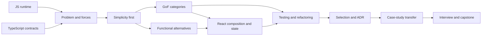

# GoF and React Design Patterns Skill Graph

This generated standard pack file is derived from canonical repository sources. It is reusable project context and does not contain learner-specific progress.

## Source: domains/gof-react-patterns/SKILL_GRAPH.md

# GoF and React Design Patterns Skill Graph

IDs stable learner competencies-dir; agent skills deyil. Status və evidence bu faylda saxlanmır.

## Foundations

- `grp.js.composition-runtime` — object composition, closure, prototype və module runtime modelini izah edir.
- `grp.ts.contracts-unions` — interface, generic, discriminated union və exhaustive narrowing ilə contract qurur.
- `grp.design.problem-forces` — symptom, change axis, coupling və forces çıxarır.
- `grp.design.simplicity` — plain function/data/direct composition candidate-lərini pattern-dən əvvəl qiymətləndirir.
- `grp.testing.public-contract` — public behavior və collaborator boundary üçün Vitest test dizayn edir.

## GoF Catalog

- `grp.gof.creational.selection` → `factory-method`, `abstract-factory`, `builder`, `prototype`, `singleton`.
- `grp.gof.structural.selection` → `adapter`, `bridge`, `composite`, `decorator`, `facade`, `flyweight`, `proxy`.
- `grp.gof.behavioral.selection` → `chain-of-responsibility`, `command`, `iterator`, `mediator`, `memento`, `observer`, `state`, `strategy`, `template-method`, `visitor`.
- Hər leaf skill `grp.gof.<pattern>` formatındadır və intent, derivation, implementation, tests, alternatives, misuse və removal evidence tələb edir.

## Alternatives və React

- `grp.functional.closure-composition` — closure və higher-order function ilə class pattern-i sadələşdirir.
- `grp.functional.data-driven` — lookup table, pipeline və discriminated union alternative qurur.
- `grp.react.composition-api` → compound components, slots, polymorphic components, render props, HOC.
- `grp.react.state-ownership` → controlled/uncontrolled, lifting state, state colocation, derived state, external store.
- `grp.react.behavior-reuse` → custom hooks, provider, reducer, state reducer, prop getter.
- `grp.react.boundary-flow` → container/presentational, headless UI, adapter hooks, optimistic UI, error boundary.
- Hər React leaf skill `grp.react.<pattern>` formatındadır və rendered behavior varsa React Testing Library evidence-i tələb edir.

## Architecture və Judgment

- `grp.arch.change-axis` — variation point, dependency direction və ownership seçir.
- `grp.arch.pattern-composition` — pattern-ləri minimum coherent architecture-da birləşdirir.
- `grp.testing.design-for-testability` — seams, fakes, contracts və deterministic tests qurur.
- `grp.refactor.safety-net` — characterization/public-contract test ilə incremental refactor edir.
- `grp.refactor.pattern-removal` — redundant abstraction-u behavior saxlayaraq silir.
- `grp.selection.decision-record` — context, candidates, decision, consequences və reversal trigger yazır.
- `grp.case-study.transfer` — unfamiliar domain-a pattern judgment transfer edir.
- `grp.interview.pattern-defense` — ambiguity altında design-i izah və müdafiə edir.
- `grp.capstone.architecture` — capstone implementation, tests və architectural defense təqdim edir.

## Dependency Graph

Bu diagram educational simplification-dır: real learning review və remediation səbəbilə geri edges daşıyır.

## Pedagogical Gates

- GoF category selection üçün foundations + problem-forces + simplicity evidence lazımdır.
- React mapping üçün React prerequisites və ən azı bir GoF category comparison lazımdır.
- Architecture composition-dan əvvəl learner iki pattern-i ayrı-ayrılıqda test etməlidir.
- Pattern removal assessment-dən əvvəl safety-net test evidence-i lazımdır.
- Capstone readiness lesson count ilə deyil, category checkpoints və transfer evidence ilə müəyyən edilir.
