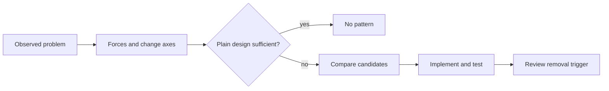
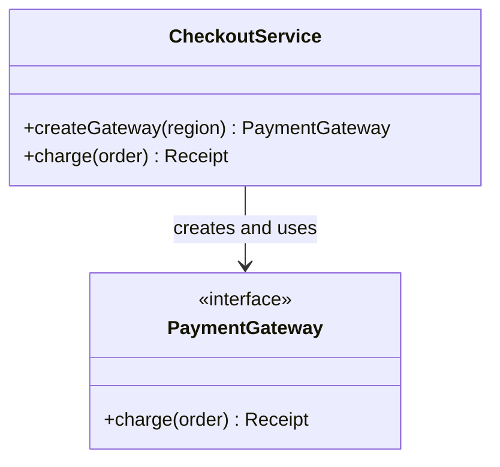
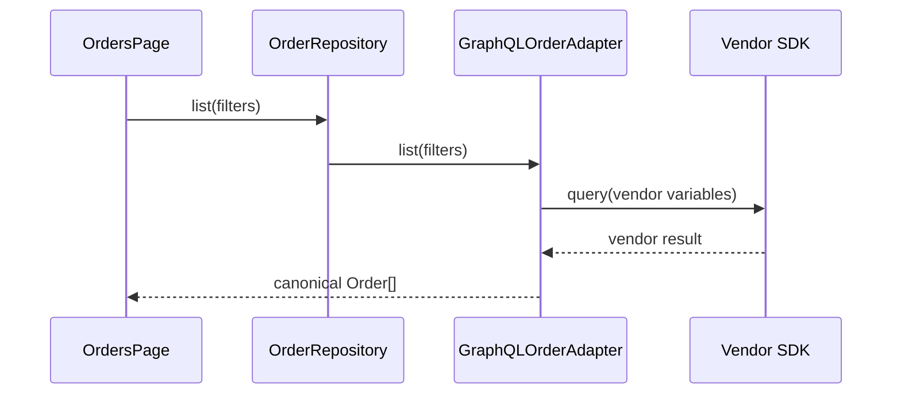
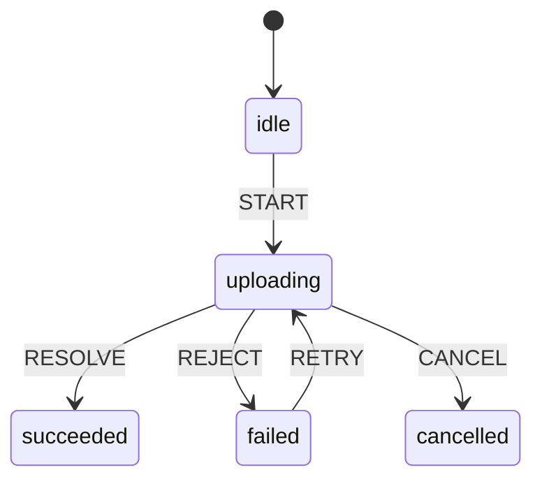
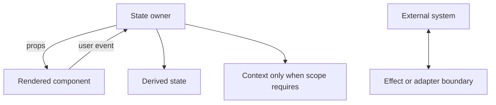
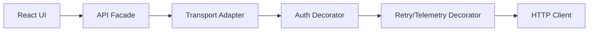

# GoF and React Design Patterns Syllabus

This generated standard pack file is derived from canonical repository sources. It is reusable project context and does not contain learner-specific progress.

## Source: domains/gof-react-patterns/SYLLABUS.md

# GoF and React Design Patterns Syllabus

`gof-react-patterns.main` 15-module progressive curriculum-dur. Catalog coverage lesson count deyil: hər pattern problem → naive design → forces → derivation → implementation → tests → trade-offs → practice flow-u ilə öyrədilir və later transfer ilə yoxlanılır.

## Every Individual Pattern Lesson: 28-Part Contract

GoF və React pattern lesson-lərinin hər biri bu 28 hissəni konkret pattern/scenario üçün doldurur:

1. Lesson title və stable skill ID.
2. Prerequisites və evidence check.
3. Realistic application context.
4. User/business problem.
5. Naive design.
6. Naive design failure mode.
7. Forces və change axes.
8. Simplest/no-pattern candidate.
9. Pattern intent, yalnız problem anlaşılandan sonra.
10. Roles və responsibilities.
11. Purposeful Mermaid diagram; simplification label-i.
12. Step-by-step derivation.
13. Public TypeScript contract.
14. Complete primary TypeScript implementation.
15. JavaScript runtime comparison, yalnız clarity verirsə.
16. Functional/data-driven alternative.
17. React/TSX connection, applicable-dirsə.
18. Vitest tests.
19. React Testing Library test, yalnız render varsa.
20. Failure paths və edge cases.
21. Testing implications və useful test doubles.
22. Benefits.
23. Costs və trade-offs.
24. Alternatives və selection criteria.
25. Misuse/anti-pattern.
26. Overengineering və “when no pattern is preferable”.
27. Guided practice + progressive hints.
28. Independent transfer, retrieval prompt və evidence checkpoint.

Mentor bu structure-u bir cavaba sıxışdırmır; teaching-first phases turn-lar arasında davam edə bilər. Complete solution attempt-dən əvvəl göstərilmir.

## Module 1 — Design Foundations: Problem Before Pattern

- Concepts: cohesion, coupling, encapsulation, composition over inheritance, dependency direction, stable/unstable boundary, change axis, accidental complexity, YAGNI.
- TypeScript: structural typing, interface as contract, discriminated union; types runtime validation deyil.
- JavaScript comparison: classes prototype üzərində runtime constructs-dır; `private` type-only və `#private` runtime semantics fərqlidir.
- Practice: notification routing və checkout conditions üçün problem/forces çıxar, plain function candidate-i qur.
- Checkpoint: learner pattern name istifadə etmədən minimum design müdafiə edir.



Diagram educational selection simplification-dır; feedback nəticəsində əvvəlki mərhələyə qayıtmaq normaldır.

## Module 2 — TypeScript, JavaScript, Testing və Diagram Literacy

- Contracts: generics, unions, exhaustive `never`, function types, object composition.
- Runtime: closure state, prototype delegation, module singleton, import caching.
- Tests: Vitest AAA, observable behavior, fake/spy/stub boundaries, deterministic time və IDs.
- Diagrams: Mermaid class, sequence, state, flow və component diagrams; role diagram-ı exact runtime object graph kimi təqdim etmə.
- Baseline task: pricing rule-u union, lookup və Strategy ilə həll et; simplest solution-u seç.

```ts
export type PriceContext = { subtotal: number; segment: "retail" | "partner" };
export type PricingRule = (context: PriceContext) => number;

export const partnerDiscount: PricingRule = ({ subtotal, segment }) =>
  segment === "partner" && subtotal >= 500 ? subtotal * 0.15 : 0;
```

```ts
import { describe, expect, it } from "vitest";

describe("partnerDiscount", () => {
  it.each([
    [{ subtotal: 499, segment: "partner" }, 0],
    [{ subtotal: 500, segment: "partner" }, 75],
    [{ subtotal: 500, segment: "retail" }, 0],
  ] as const)("returns the public discount for %o", (context, expected) => {
    expect(partnerDiscount(context)).toBe(expected);
  });
});
```

## Module 3 — Creational GoF Patterns (5)

Hər lesson 28-part contract-a tabedir.

| Lesson | Pattern | Realistic derivation və required comparison |
| --- | --- | --- |
| 3.1 | Factory Method | Payment provider connector creation; direct constructor/simple factory; functional factory; lifecycle tests; subclass explosion və no-pattern threshold |
| 3.2 | Abstract Factory | Theme/design-system family: button, dialog, tokens; independent factories; React provider connection; inconsistent family test; two variants üçün overengineering |
| 3.3 | Builder | Valid multi-step API request/report configuration; object literal + validation; fluent vs functional builder; invalid intermediate state və test-data builder misuse |
| 3.4 | Prototype | Dashboard widget configuration cloning; immutable spread/structured clone; identity/deep-copy risks; React element cloning ilə false equivalence-dən qaç |
| 3.5 | Singleton | Process-wide telemetry registry candidate; module instance/dependency injection; test isolation, SSR/request leakage; default olaraq reject etməyi bacar |

Factory Method educational class simplification:



Required implementation/test pair:

```ts
type Region = "eu" | "us";
type Receipt = { provider: string; transactionId: string };
interface PaymentGateway { charge(orderId: string): Promise<Receipt> }

export function createGateway(
  region: Region,
  deps: { eu: PaymentGateway; us: PaymentGateway },
): PaymentGateway {
  return deps[region];
}

export class CheckoutService {
  constructor(private readonly gatewayFor: (region: Region) => PaymentGateway) {}
  charge(region: Region, orderId: string) {
    return this.gatewayFor(region).charge(orderId);
  }
}
```

```ts
it("routes an EU charge through the selected gateway", async () => {
  const eu = { charge: vi.fn().mockResolvedValue({ provider: "adyen", transactionId: "tx-1" }) };
  const us = { charge: vi.fn() };
  const service = new CheckoutService((region) => createGateway(region, { eu, us }));
  await expect(service.charge("eu", "ord-1")).resolves.toMatchObject({ provider: "adyen" });
  expect(eu.charge).toHaveBeenCalledWith("ord-1");
  expect(us.charge).not.toHaveBeenCalled();
});
```

## Module 4 — Structural GoF Patterns (7)

| Lesson | Pattern | Realistic derivation və required comparison |
| --- | --- | --- |
| 4.1 | Adapter | REST/GraphQL SDK-ləri canonical order repository contract-a uyğunlaşdır; mapping errors test et; hook adapter connection-ını one-to-one equivalence sayma |
| 4.2 | Bridge | Notification abstraction-ını email/SMS transports-dan ayır; Strategy və Adapter-lə müqayisə; two-dimensional variation yoxdursa rədd et |
| 4.3 | Composite | Permission tree və dashboard layout; recursive function/data tree alternative; partial failure və identity testləri |
| 4.4 | Decorator | API client retry, auth, cache, telemetry wrappers; order-sensitive sequence test; higher-order function alternative; wrapper maze misuse |
| 4.5 | Facade | Layered API client üçün small task-oriented surface; leaky god facade və direct composition comparison |
| 4.6 | Flyweight | Large data-table cell metadata sharing; memoization/normalized data; premature memory optimization-u profiling olmadan rədd et |
| 4.7 | Proxy | Permission-aware/caching remote document access; Decorator fərqi, JavaScript `Proxy` API ilə pattern intent fərqi; hidden network cost misuse |

Adapter sequence diagram educational simplification-dır:



```ts
type Order = { id: string; totalCents: number };
type VendorOrder = { order_no: string; total: string };
interface OrderRepository { list(): Promise<Order[]> }

export class VendorOrderAdapter implements OrderRepository {
  constructor(private readonly sdk: { fetchOrders(): Promise<VendorOrder[]> }) {}
  async list(): Promise<Order[]> {
    const rows = await this.sdk.fetchOrders();
    return rows.map((row) => {
      const totalCents = Math.round(Number(row.total) * 100);
      if (!Number.isFinite(totalCents)) throw new Error(`Invalid total for ${row.order_no}`);
      return { id: row.order_no, totalCents };
    });
  }
}
```

```ts
it("maps vendor fields and rejects corrupt money", async () => {
  const valid = new VendorOrderAdapter({ fetchOrders: async () => [{ order_no: "A-7", total: "12.34" }] });
  await expect(valid.list()).resolves.toEqual([{ id: "A-7", totalCents: 1234 }]);
  const corrupt = new VendorOrderAdapter({ fetchOrders: async () => [{ order_no: "A-8", total: "n/a" }] });
  await expect(corrupt.list()).rejects.toThrow("Invalid total for A-8");
});
```

## Module 5 — Behavioral GoF Patterns (11)

| Lesson | Pattern | Realistic derivation və required comparison |
| --- | --- | --- |
| 5.1 | Chain of Responsibility | Permission/feature-flag evaluation; rules pipeline; order, short-circuit və denial reason tests |
| 5.2 | Command | Undoable editor actions və queued uploads; plain callback; serialization/undo cost; command-object explosion |
| 5.3 | Iterator | Paginated API traversal; generator/async iterator; cancellation və page failure tests |
| 5.4 | Mediator | Checkout form sections və workflow coordinator; event bus/direct callbacks; god mediator misuse |
| 5.5 | Memento | Editor snapshots; event sourcing/command inverse; memory, privacy və schema evolution |
| 5.6 | Observer | Scoped notification/store subscription; event emitter/React state; unsubscribe, reentrancy və leak tests |
| 5.7 | State | Upload lifecycle; discriminated-union reducer alternative; illegal transition tests; boolean flag explosion |
| 5.8 | Strategy | Pricing/tax algorithm variation; function map alternative; conditional simpler olduqda no-pattern |
| 5.9 | Template Method | Import pipeline invariant skeleton; function pipeline/composition; inheritance rigidity |
| 5.10 | Visitor | Versioned AST/report export operations; discriminated union exhaustive functions; new-node vs new-operation change axis |
| 5.11 | Interpreter | Filter rule language üçün small AST evaluator; parser library/direct predicates; security və scope limits |

> GoF catalog traditional olaraq 11 behavioral pattern daşıyır; `Interpreter` daxil olmaqla cəmi 23 pattern coverage qorunur.

State example:



```ts
type UploadState =
  | { status: "idle" }
  | { status: "uploading"; file: string; attempt: number }
  | { status: "succeeded"; url: string }
  | { status: "failed"; file: string; attempt: number; message: string }
  | { status: "cancelled" };

type UploadEvent =
  | { type: "START"; file: string }
  | { type: "RESOLVE"; url: string }
  | { type: "REJECT"; message: string }
  | { type: "RETRY" }
  | { type: "CANCEL" };

export function transition(state: UploadState, event: UploadEvent): UploadState {
  if (event.type === "START" && state.status === "idle")
    return { status: "uploading", file: event.file, attempt: 1 };
  if (event.type === "RESOLVE" && state.status === "uploading")
    return { status: "succeeded", url: event.url };
  if (event.type === "REJECT" && state.status === "uploading")
    return { status: "failed", file: state.file, attempt: state.attempt, message: event.message };
  if (event.type === "RETRY" && state.status === "failed")
    return { status: "uploading", file: state.file, attempt: state.attempt + 1 };
  if (event.type === "CANCEL" && state.status === "uploading") return { status: "cancelled" };
  throw new Error(`Illegal ${event.type} from ${state.status}`);
}
```

```ts
it("retries the same file and rejects an illegal resolve", () => {
  const failed: UploadState = { status: "failed", file: "invoice.pdf", attempt: 1, message: "timeout" };
  expect(transition(failed, { type: "RETRY" })).toEqual({
    status: "uploading", file: "invoice.pdf", attempt: 2,
  });
  expect(() => transition({ status: "idle" }, { type: "RESOLVE", url: "/x" }))
    .toThrow("Illegal RESOLVE from idle");
});
```

## Module 6 — OO Catalog vs Functional and Data-Driven Alternatives

- Class Strategy vs function map; Command object vs closure; Iterator class vs generator; Template Method vs pipeline; Visitor vs exhaustive union.
- Compare dimensions: extensibility axis, runtime state, serialization, identity, tree-shaking, test seams, team familiarity.
- JavaScript example compares prototype method dispatch with closure composition without claiming one universally better.
- Practice: five GoF implementations-i simplify et; behavior və error tests-i saxla.
- Checkpoint: learner at least two patterns-i remove edir və reintroduction trigger yazır.

## Module 7 — React Mental Models Before React Patterns

- Component identity, render/commit, props, local state, context, effects, refs, controlled data flow.
- Composition is language/framework mechanism; every composed component “Composite pattern” deyil.
- Hook reuse GoF inheritance replacement-i kimi universal equivalence deyil.
- Server/client boundaries və concurrent rendering hidden mutable singleton riskini artırır.
- Testing: pure reducer/hook logic Vitest; user-visible render React Testing Library.



Diagram educational simplification-dır; React internals və scheduling-i təsvir etmir.

## Module 8 — Twenty React Patterns

Hər lesson eyni 28-part contract-a tabedir və GoF connection varsa onu “conceptual comparison” kimi label edir.

| Lesson | React pattern | Real application, comparisons və tests |
| --- | --- | --- |
| 8.1 | Compound Components | Accessible Tabs/Dialog API; prop configuration alternative; Context cost; rendered keyboard/selection test |
| 8.2 | Controlled and Uncontrolled Components | Search/filter inputs; source-of-truth, reset and synchronization; local state no-pattern; RTL interaction |
| 8.3 | Container/Presentational | Orders data orchestration vs view; custom hook alternative; artificial folder split misuse |
| 8.4 | Custom Hooks | Upload/auth behavior reuse; plain function/service; hook lifecycle tests only when behavior requires render |
| 8.5 | Render Props | Measurement/permission behavior injection; custom hook alternative; callback nesting and render identity |
| 8.6 | Higher-Order Components | Legacy authorization/telemetry wrapper; hooks/composition; prop collision and DevTools cost |
| 8.7 | Provider Pattern | Theme/session/service scope; props/module dependency; god context and rerender cost |
| 8.8 | Reducer Pattern | Multi-step form/upload state transitions; local states/state machine; pure Vitest tests |
| 8.9 | State Reducer | Headless selection component consumer overrides; callback alternative; unsafe transition override |
| 8.10 | Prop Getter | Accessible headless toggle props merging; explicit props/slot; handler composition and ref merge tests |
| 8.11 | Headless UI | Dialog/listbox behavior separate from styling; component library alternative; accessibility is mandatory |
| 8.12 | Slots | Dashboard card/design-system layout extension; children props; implicit slot naming misuse |
| 8.13 | Polymorphic Components | Design-system `as` API; fixed variants; TypeScript ref/prop correctness and semantic misuse |
| 8.14 | State Colocation | Row editor/form draft near consumer; global store alternative; reset identity test |
| 8.15 | Lifting State Up | Sibling filter/result coordination; context/store alternative; lift only to nearest owner |
| 8.16 | Derived State | Filtered rows/validation from source state; duplicated synchronized state anti-pattern; pure function tests |
| 8.17 | External Store | Cross-tree session/widget state with selectors; context/server cache; tearing/subscription implications |
| 8.18 | Adapter Hooks | Vendor query/router API behind app contract; direct hook; migration and error mapping tests |
| 8.19 | Optimistic UI | Dashboard status update with rollback; pessimistic update; race/idempotency/accessibility behavior |
| 8.20 | Error Boundary | Render failure isolation and recovery; async/event error handling differs; fallback/retry RTL test |

Compound Components implementation:

```tsx
type TabsContextValue = { active: string; select(id: string): void };
const TabsContext = createContext<TabsContextValue | null>(null);

export function Tabs({ value, onValueChange, children }: {
  value: string; onValueChange(value: string): void; children: ReactNode;
}) {
  return <TabsContext.Provider value={{ active: value, select: onValueChange }}>{children}</TabsContext.Provider>;
}

Tabs.Tab = function Tab({ id, children }: { id: string; children: ReactNode }) {
  const tabs = useContext(TabsContext);
  if (!tabs) throw new Error("Tabs.Tab must be inside Tabs");
  return (
    <button role="tab" aria-selected={tabs.active === id} onClick={() => tabs.select(id)}>
      {children}
    </button>
  );
};
```

```tsx
it("lets the user select a compound tab through its public API", async () => {
  const user = userEvent.setup();
  function Example() {
    const [value, setValue] = useState("summary");
    return (
      <Tabs value={value} onValueChange={setValue}>
        <Tabs.Tab id="summary">Summary</Tabs.Tab>
        <Tabs.Tab id="history">History</Tabs.Tab>
      </Tabs>
    );
  }
  render(<Example />);
  await user.click(screen.getByRole("tab", { name: "History" }));
  expect(screen.getByRole("tab", { name: "History" })).toHaveAttribute("aria-selected", "true");
});
```

## Module 9 — GoF and React Connections Without False Equivalence

- Observer ↔ subscriptions/context/external stores: conceptual event propagation comparison, not exact identity.
- Strategy ↔ component/function injection; State ↔ reducer/state machine; Adapter ↔ adapter hook; Decorator ↔ wrapper/HOC; Composite ↔ component tree.
- Differences: React scheduling, identity, hooks rules, render purity, server rendering, accessibility və source-of-truth.
- Practice: ten claimed mappings-i “useful analogy / misleading / unrelated” kimi review et.
- Checkpoint: learner similarity və at least two decisive differences göstərir.

## Module 10 — Anti-Patterns and Overengineering

- Pattern mania, speculative generality, interface-per-class, abstract factory for two static variants, singleton stores, service locator, event-bus opacity, god mediator/facade/context, deep decorator stack, HOC/render-prop nesting, premature external store, duplicated derived state.
- “Pattern tax” inventory: types/files/indirection/debug path/test doubles/onboarding/migration.
- Practice: pattern zoo PR-a Senior review; simpler diff və rollback plan.
- Checkpoint: public behavior saxlanaraq at least 30% unnecessary indirection remove edilir; percentage mastery metric deyil.

## Module 11 — Architecture Composition and Decision Records

- Compose patterns only where forces intersect: API client (Adapter + Decorator + Facade), editor (Command + Memento), upload (State + Strategy), design system (Abstract Factory + Provider + compound/headless APIs).
- Decision record: context, forces, candidates, decision, consequences, test strategy, migration, reversal/removal triggers.
- Diagram must state educational vs production scope.
- Practice: dashboard widget architecture üçün two candidate architectures və ADR.



Educational simplification: production wrapper order və retry/auth semantics ayrıca qərardır.

## Module 12 — Testing Patterned Systems

- Contract tests, collaborator tests, state transition tables, wrapper-order tests, subscription cleanup, cache/identity, error and cancellation.
- Mock only owned boundary; tests pattern class names-i deyil observable contract-ı qoruyur.
- React rendered behavior semantic role/name/userEvent ilə; pure reducers and strategies Vitest ilə.
- Practice: brittle implementation-detail suite-i behavior safety net-ə çevir.
- Checkpoint: alternative implementation eyni contract suite-dən keçə bilir.

## Module 13 — Refactoring, Migration and Pattern Removal

- Characterize behavior → isolate seam → small refactor → run tests → compare complexity → document consequence.
- Branch by abstraction yalnız real migration ehtiyacında; dual-write/double dispatch risklərini test et.
- Removal triggers: variation disappeared, one implementation remains, wrapper adds no policy, ownership local oldu, abstraction leaks more than protects.
- Practice: `PRACTICE_RULES.md` 12 labs; at least one introduce-pattern və one remove-pattern transfer.

## Module 14 — Twelve Integrated Case Studies

`PROJECTS.md` sequence-i notification, checkout, API client, permissions/flags, data table, headless dialog, form, editor, design-system factory, upload, pricing və dashboard architecture üzərindən işlənir. Hər case requirements → baseline → pattern candidates → implementation/tests → rejection/removal → decision note milestone-ları ilə gedir.

## Module 15 — Selection, Capstone and Interview Readiness

- Pattern selection matrix: change axis, lifetime/identity, control flow, state ownership, async/failure, extension frequency, team cost, testability.
- Three capstone options `PROJECTS.md`-dədir.
- Interview: Junior/Mid/Senior/Staff-Lead; coached, simulation, rapid-fire, code-review.
- Final evidence: implementation + Vitest/RTL tests + diagram + alternatives + misuse + migration/removal + unfamiliar transfer defense.
- No solution before attempt; final lesson exposure learner-i mastered etmir.

## Coverage Ledger

GoF total: 5 creational + 7 structural + 11 behavioral = 23. React total: Module 8-də exactly 20 named lessons. Modules total: exactly 15.
